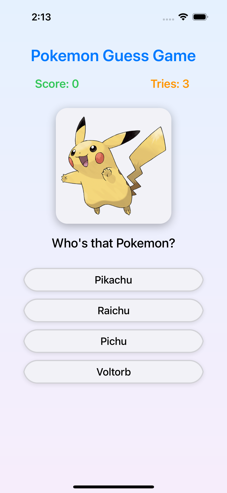

# 🎮 Pokemon Guess Game
<p align="center">
  
</p>
A beautiful iOS Pokemon guessing game built with **UIKit programmatically** and **RxSwift/RxCocoa** following the **MVVM architecture pattern**. The game displays Pokemon images and challenges players to guess the correct name from 4 multiple choice options with 3 tries per Pokemon.

## 📱 Features

- **Beautiful UI Design**: Modern gradient background, rounded corners, shadows, and smooth animations
- **Game Mechanics**: 3 tries per Pokemon, score tracking (10 points per correct answer), progressive difficulty
- **Reactive Programming**: Complete RxSwift implementation for data binding and event handling
- **MVVM Architecture**: Clean separation of concerns with Model-View-ViewModel pattern
- **Mock Data**: 5 popular Pokemon (Pikachu, Bulbasaur, Charmander, Squirtle, Mewtwo) with real API images
- **Visual Feedback**: Color-coded responses (green for correct, red for wrong answers)
- **Auto-progression**: Automatically moves to next Pokemon after correct answer

## 🏗️ Architecture

```
pokemon-game/
├── View/
│   └── ViewController.swift      # UI components and RxSwift bindings
├── Model/
│   └── Pokemon.swift            # Data models and mock data
├── ViewModel/
│   └── GameViewModel.swift      # Business logic and state management
└── [Supporting Files...]
```

## 🎯 Game Flow

1. **Start**: Display Pokemon image with 4 multiple choice options
2. **Guess**: Tap an option to make your guess (3 tries available)
3. **Feedback**: 
   - ✅ **Correct**: Green feedback, +10 points, auto-advance to next Pokemon
   - ❌ **Wrong**: Red feedback, -1 try, continue if tries remain
4. **Game Over**: When all tries are used or all Pokemon completed
5. **Restart**: "New Game" button appears to play again

## 🛠️ Technologies Used

- **UIKit** (Programmatic UI - No Storyboards)
- **RxSwift & RxCocoa** (Reactive Programming)
- **MVVM Architecture** (Clean Code Structure)
- **URLSession** (Image Loading)
- **Auto Layout** (Responsive Design)

## 🔧 Setup & Installation

1. Clone the repository
2. Open `pokemon-game.xcodeproj` in Xcode
3. Make sure RxSwift package is resolved (should be automatic)
4. Build and run the project (⌘+R)

**Requirements**: iOS 16.4+, Xcode 14.0+, Swift 5.0+

## 📚 For Me: Remember It 😅

### **RxSwift Concepts Used (Learning Reference):**

| Concept | Usage | Why Important |
|---------|-------|---------------|
| **BehaviorRelay** | `score`, `remainingTries`, `gameState` | Always has current value, perfect for UI state |
| **PublishSubject** | `answerSelected`, `newGameTapped` | Handle user input events |
| **DisposeBag** | Memory management | Prevents memory leaks automatically |
| **.bind(to:)** | UI data binding | Automatic UI updates when data changes |
| **.map** | Data transformation | Convert types (Int → String, Bool → Bool) |
| **.subscribe** | Custom logic | Handle complex scenarios beyond simple binding |
| **RxCocoa** | `button.rx.tap`, `label.rx.text` | Reactive extensions for UIKit |
| **.withLatestFrom** | Button tap + current data | Combine events with latest state |
| **.compactMap** | Safe unwrapping | Filter out nil values safely |

### **Key RxSwift Benefits Learned:**
- ✅ **Declarative Code**: Describe what should happen, not how
- ✅ **Automatic UI Updates**: Change data once, UI updates everywhere
- ✅ **No Memory Leaks**: DisposeBag handles cleanup
- ✅ **Separation of Concerns**: View = Presentation, ViewModel = Logic
- ✅ **Easy Testing**: Pure logic in ViewModels
- ✅ **Consistent State**: BehaviorRelay ensures UI always shows current state

### **Traditional vs RxSwift:**
```swift
// ❌ Traditional: Manual UI updates everywhere
func updateScore(_ newScore: Int) {
    score = newScore
    scoreLabel.text = "Score: \(newScore)"
}

// ✅ RxSwift: Automatic, declarative binding
viewModel.score
    .map { "Score: \($0)" }
    .bind(to: scoreLabel.rx.text)
    .disposed(by: disposeBag)
```

**Remember**: RxSwift transforms imperative "do this, then this" code into declarative "when this happens, that should update" relationships! 🎯

---

**Main Purpose**: Understanding and practicing RxSwift reactive programming concepts in a real iOS application with MVVM architecture. 
